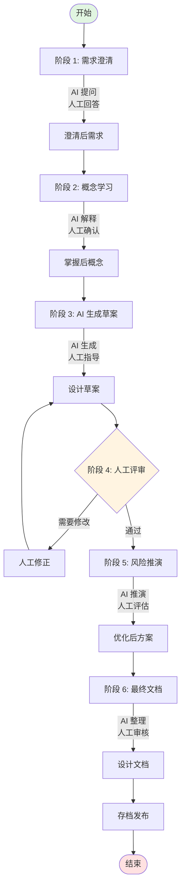

# 2.1 AI 辅助设计工作流（AI-Assisted Design Flow）

## 本章目标

掌握使用 AI 工具辅助架构设计的完整工作流，能够高效产出高质量的设计文档。

## 核心概念

### 什么是 AI-Assisted Design Flow？

**一句话定义：**
一套结构化的设计方法论，通过与 AI 协作，从需求到最终设计文档的完整流程。

**核心理念：**
- AI 是设计助手，不是设计替代者
- 人机协作：AI 生成草案，人工审查修正
- 迭代优化：多轮交互逐步完善
- 质量保障：每个阶段都有明确的检查点

**与传统设计流程的区别：**

| 维度 | 传统设计流程 | AI-Assisted Design Flow |
|------|-------------|------------------------|
| 需求理解 | 人工分析，可能遗漏 | AI 提问澄清，覆盖更全面 |
| 概念学习 | 查阅文档，耗时较长 | AI 快速解释，直觉理解 |
| 方案生成 | 人工绘制，从零开始 | AI 生成草案，快速启动 |
| 风险评估 | 依赖经验，可能遗漏 | AI 辅助推演，系统化识别 |
| 文档编写 | 人工撰写，耗时 | AI 辅助生成，人工润色 |
| 效率 | 较慢 | 提升 2-5 倍 |

## AI-Assisted Design Flow 完整流程

```
┌─────────────────────────────────────────────────────────────────┐
│                   AI-Assisted Design Flow                       │
│                     AI 辅助设计工作流                            │
└─────────────────────────────────────────────────────────────────┘

阶段 1: 需求澄清        阶段 2: 概念学习        阶段 3: AI 生成草案
┌──────────────┐       ┌──────────────┐       ┌──────────────┐
│   原始需求    │       │   技术概念    │       │   设计草案    │
│   (模糊)     │       │   (未知)     │       │   (初稿)     │
└──────┬───────┘       └──────┬───────┘       └──────┬───────┘
       │                      │                      │
       ▼                      ▼                      ▼
┌──────────────┐       ┌──────────────┐       ┌──────────────┐
│  AI 提问清单  │       │  AI 概念解释  │       │  AI 生成      │
│  (澄清问题)   │       │  (直觉理解)   │       │  (图/表/文)   │
└──────┬───────┘       └──────┬───────┘       └──────┬───────┘
       │                      │                      │
       ▼                      ▼                      ▼
┌──────────────┐       ┌──────────────┐       ┌──────────────┐
│   澄清后需求   │       │   理解后概念   │       │   草案待审    │
│   (明确)     │       │   (掌握)     │       │   (评审)     │
└──────────────┘       └──────────────┘       └──────────────┘

阶段 4: 人工评审修正      阶段 5: 风险推演        阶段 6: 最终文档
┌──────────────┐       ┌──────────────┐       ┌──────────────┐
│   草案评审    │       │   风险识别    │       │   最终设计    │
│   (检查点)   │       │   (待推演)   │       │   (交付)     │
└──────┬───────┘       └──────┬───────┘       └──────┬───────┘
       │                      │                      │
       ▼                      ▼                      ▼
┌──────────────┐       ┌──────────────┐       ┌──────────────┐
│  人工修正     │       │  AI 风险推演  │       │  设计文档     │
│  (调整优化)   │       │  (替代方案)   │       │  (标准化)    │
└──────┬───────┘       └──────┬───────┘       └──────┬───────┘
       │                      │                      │
       ▼                      ▼                      ▼
┌──────────────┐       ┌──────────────┐       ┌──────────────┐
│   修正后草案   │       │   优化后方案   │       │   存档发布    │
│   (完善)     │       │   (健壮)     │       │   (可用)     │
└──────────────┘       └──────────────┘       └──────────────┘
```

## 阶段详解

### 阶段 1：需求澄清（Clarification）

**目标：** 将模糊的需求转化为明确、结构化的需求文档

**AI 作用：**
- 生成需求澄清问题清单
- 识别模糊点与待确认项
- 输出需求结构化框架

**人工职责：**
- 回答 AI 的问题
- 补充业务背景
- 确认约束条件

**提示词模板：**
```
角色：你是一位经验丰富的架构师，擅长需求分析。

任务：请帮我澄清以下设计需求，生成需求澄清文档。

原始需求：
[粘贴需求描述]

请输出：
1. 需求澄清问题清单（至少 10 个问题）
   - 功能性问题
   - 非功能性问题（性能、安全、成本）
   - 边界与约束问题

2. 关键术语定义建议
   - 术语表
   - 建议的统一命名

3. 需求结构化框架
   - 功能需求
   - 非功能需求
   - 约束条件
   - 验收标准

4. 潜在风险点提示
   - 需求冲突
   - 技术可行性风险
   - 资源约束风险
```

**输出示例：**
```markdown
## 需求澄清文档：[项目名称]

### 澄清问题清单

#### 功能性问题
1. [ ] 系统的核心用户是谁？（内部员工/外部客户/两者都有）
2. [ ] 预期的日活用户量是多少？峰值是多少？
3. [ ] 主要使用场景有哪些？请按优先级排序
4. [ ] 与其他系统的集成需求？

#### 非功能性问题
5. [ ] 可接受的响应延迟是多少？（P95/P99）
6. [ ] 可用性要求是多少？（99.9%/99.99%）
7. [ ] 预算上限是多少？（月/年）
8. [ ] 数据安全等级要求？

#### 边界与约束
9. [ ] 项目交付时间要求？
10. [ ] 技术栈限制？（必须使用/禁止使用）
11. [ ] 运维团队规模与能力？

### 关键术语定义
| 术语 | 建议定义 | 备注 |
|------|----------|------|
| XX | ... | ... |

### 需求结构化
[按框架组织]

### 潜在风险
1. 风险 A：描述 + 缓解建议
2. 风险 B：描述 + 缓解建议
```

---

### 阶段 2：概念快速学习（Concept Learning）

**目标：** 快速掌握设计所需的技术概念

**AI 作用：**
- 用通俗语言解释技术概念
- 提供类比帮助理解
- 生成对比表
- 输出关键决策点

**人工职责：**
- 确认理解程度
- 追问不清楚的点
- 关联已有知识

**提示词模板：**
```
角色：你是一位技术布道者，擅长将复杂技术概念讲解得通俗易懂。

任务：请帮我理解以下技术概念。

目标人群：有 [N] 年经验的 Java 工程师，熟悉 Spring Boot，对 AI 了解有限。

需要理解的概念：[概念名称]

请输出：
1. 核心直觉（200 字以内，无数学公式）
   - 一句话定义
   - 工作原理的通俗解释

2. 类比说明（2-3 个类比）
   - 日常生活类比
   - 软件工程类比

3. 与现有技术（Java/Spring/微服务）的关联
   - 相似概念对比
   - 学习路径建议

4. 关键设计决策点
   - 使用这个技术时需要做的决策
   - 常见选型场景
   - 反模式（不应该这样做）

5. 常见误区澄清
   - 新手容易误解的点
   - 与相似技术的区别

6. 进阶学习资源推荐
   - 文档/视频/论文（按优先级）
```

---

### 阶段 3：AI 生成设计草案（Design Drafting）

**目标：** 快速产出设计草案（架构图、决策表、流程图）

**AI 作用：**
- 生成 Mermaid/PlantUML 架构图
- 输出组件清单与职责表
- 生成决策矩阵
- 提供接口定义草稿

**人工职责：**
- 提供清晰的需求输入
- 评审草案合理性
- 指定输出格式

**提示词模板（架构图）：**
```
角色：你是一位经验丰富的系统架构师。

任务：请基于以下需求生成系统架构设计草案。

需求描述：
[需求描述]

约束条件：
- 技术栈：[Java/Spring Cloud/...]
- 性能要求：[QPS/Latency]
- 成本约束：[预算范围]

请输出：
1. 系统架构图（Mermaid 格式）
   - 分层清晰（接入层/服务层/数据层）
   - 标注核心组件
   - 显示数据流向
   - 标注关键技术选型

2. 组件清单表
   | 组件名 | 职责 | 技术选型 | 部署方式 |

3. 核心接口定义（伪代码/IDL）
   - 关键 API 定义
   - 请求/响应格式

4. 数据流说明
   - 主流程数据流
   - 异常处理流

5. 关键技术决策点
   - 需要做哪些技术决策
   - 每个决策的选项与建议
```

**提示词模板（决策表）：**
```
任务：请生成技术选型决策表。

决策场景：[场景描述]

待决策项：
- [决策项 1]
- [决策项 2]
- [决策项 3]

约束条件：
[约束描述]

请输出：
1. 决策矩阵（每个决策项）
   | 选项 | 优点 | 缺点 | 适用场景 | 推荐度 |

2. 决策建议
   - 推荐的选型组合
   - 选择理由
   - 风险提示

3. 替代方案
   - 如果推荐方案不可行时的备选
```

---

### 阶段 4：人工评审与修正（Review & Refine）

**目标：** 确保设计草案的质量与可行性

**AI 作用：**
- 提供评审检查清单
- 识别潜在问题
- 生成修正建议

**人工职责：**
- 逐项检查设计草案
- 根据业务知识修正
- 补充遗漏点

**评审检查清单（AI 生成）：**
```
请帮我评审以下架构设计草案：

[粘贴设计草案]

请生成评审检查清单，包含：

1. 架构层面
   - [ ] 分层是否合理？
   - [ ] 职责划分是否清晰？
   - [ ] 耦合度是否过高？
   - [ ] 扩展性如何？

2. 技术层面
   - [ ] 技术选型是否合理？
   - [ ] 性能是否满足需求？
   - [ ] 可用性设计是否充分？
   - [ ] 安全考虑是否全面？

3. 工程层面
   - [ ] 是否可维护？
   - [ ] 是否可测试？
   - [ ] 部署复杂度如何？
   - [ ] 运维友好度如何？

4. 风险识别
   - 列出识别到的潜在风险
   - 每个风险的影响与概率
   - 缓解建议

请逐项分析，指出存在的问题并提出修正建议。
```

---

### 阶段 5：AI 辅助边界推演（Risk Analysis）

**目标：** 识别边界条件、异常场景、潜在风险

**AI 作用：**
- 生成边界条件清单
- 推演故障场景
- 生成测试用例
- 提供降级方案

**人工职责：**
- 评审风险识别的完整性
- 评估风险优先级
- 确认应对策略

**提示词模板：**
```
角色：你是一位擅长风险识别的架构师。

任务：请帮我推演以下设计方案的边界条件和风险。

设计方案：
[设计方案]

请输出：

1. 边界条件清单
   | 边界类型 | 场景 | 预期行为 | 潜在问题 |
   | 数据边界 | 空输入/超大输入/特殊字符 | ... | ... |
   | 性能边界 | 高并发/大数据量/长耗时 | ... | ... |
   | 时间边界 | 超时/定时任务/时区 | ... | ... |
   | 依赖边界 | 下游故障/网络抖动 | ... | ... |

2. 故障场景推演
   - 场景 1：[组件 A] 故障
     - 影响范围
     - 级联效应
     - 应对措施
   - 场景 2：[组件 B] 故障
   - ...

3. 降级策略建议
   - 分层降级方案
   - 触发条件
   - 回退机制

4. 测试用例建议
   - 核心测试场景
   - 边界测试场景
   - 压力测试场景

5. 监控告警建议
   - 关键指标
   - 告警阈值
   - 响应流程
```

---

### 阶段 6：形成最终设计文档（Final Documentation）

**目标：** 产出标准化、可交付的设计文档

**AI 作用：**
- 整理结构化文档
- 生成标准格式（ADR、设计文档模板）
- 润色文字表达
- 生成图表说明

**人工职责：**
- 审核文档完整性
- 确认技术决策
- 最终批准发布

**文档模板（AI 生成）：**
```
请基于以下设计内容生成最终设计文档：

设计内容：
[所有阶段的内容汇总]

请输出标准格式的设计文档：

```markdown
# 设计文档：[系统名称]

## 1. 概述
### 1.1 背景
### 1.2 目标
### 1.3 范围

## 2. 需求分析
### 2.1 功能需求
### 2.2 非功能需求
### 2.3 约束条件

## 3. 架构设计
### 3.1 整体架构（含架构图）
### 3.2 分层设计
### 3.3 核心组件
### 3.4 数据流

## 4. 详细设计
### 4.1 模块 A 设计
### 4.2 模块 B 设计
### ...

## 5. 技术决策
### 5.1 决策记录（ADR 格式）
### 5.2 决策理由
### 5.3 替代方案

## 6. 风险与应对
### 6.1 风险清单
### 6.2 应对措施
### 6.3 降级策略

## 7. 实施计划
### 7.1 里程碑
### 7.2 依赖关系
### 7.3 验收标准

## 8. 附录
### 8.1 术语表
### 8.2 参考资料
### 8.3 修订历史
```

请确保：
- 结构完整
- 逻辑清晰
- 图表配套（Mermaid）
- 适合技术评审使用
```

---

## AI-Assisted Design Flow 工作流图



---

## 各阶段时间分配建议

| 阶段 | 时间占比 | AI 参与 | 人工参与 |
|------|----------|---------|----------|
| 1. 需求澄清 | 15% | 生成问题 | 回答问题 |
| 2. 概念学习 | 15% | 解释概念 | 确认理解 |
| 3. 生成草案 | 20% | 生成图表 | 提供输入 |
| 4. 人工评审 | 25% | 提供检查清单 | 审查修正 |
| 5. 风险推演 | 15% | 推演场景 | 评估确认 |
| 6. 最终文档 | 10% | 整理文档 | 审核发布 |

---

## Vibe Coding 提示词模板库

### 模板 1：需求澄清
```
作为架构师，请帮我澄清 [项目] 的设计需求。

原始需求：
[描述]

请生成：
1. 需求澄清问题清单（至少 10 个）
2. 术语定义表
3. 需求结构化框架
4. 风险点提示
```

### 模板 2：概念学习
```
请用 Java 工程师能理解的方式解释 [技术概念]：

1. 核心直觉（无公式）
2. 类比说明
3. 与 Java/Spring 的关联
4. 关键决策点
5. 常见误区
```

### 模板 3：架构图生成
```
基于以下需求，生成系统架构图（Mermaid）：

需求：
[描述]

约束：
[约束]

请输出：
1. 架构图
2. 组件清单
3. 接口定义
4. 技术决策点
```

### 模板 4：决策矩阵
```
请为 [决策场景] 生成技术选型决策矩阵：

待决策：
- [选项 A/B/C]

约束：
[约束]

请输出决策表，含优缺点和推荐度。
```

### 模板 5：风险推演
```
请推演以下设计的边界条件和风险：

设计：
[设计]

请输出：
1. 边界条件清单
2. 故障场景推演
3. 降级策略
4. 测试用例建议
```

### 模板 6：文档整理
```
请基于以下内容生成标准设计文档：

内容：
[汇总内容]

请使用标准模板输出完整文档。
```

---

## 认知能力产出

### 产出 1：AI-Assisted Design Flow 流程图

要求：
- 展示 6 个阶段的流转
- 标注 AI 与人工的职责边界
- 显示决策点（如评审是否通过）
- 适合团队培训使用

### 产出 2：个人提示词模板库

要求：
- 至少 6 个常用场景的提示词模板
- 每个模板包含：场景、输入、输出格式
- 可复用、可迭代
- 按使用频率排序

### 产出 3：设计文档标准模板

要求：
- 基于 ADR + 设计文档的混合模板
- 包含所有必需章节
- 提供填写指南
- 配套检查清单

---

## 本章小结

- AI-Assisted Design Flow 是结构化的人机协作流程
- 6 个阶段：需求澄清 → 概念学习 → 生成草案 → 人工评审 → 风险推演 → 最终文档
- AI 负责生成和推演，人工负责审查和决策
- 效率可提升 2-5 倍，同时保证设计质量
- 提示词模板库是复用知识的关键

## 思考题

1. 在 AI-Assisted Design Flow 中，哪些环节人工必须深度参与，哪些可以交给 AI？
2. 如何建立团队共享的提示词模板库？
3. 如果 AI 生成的设计草案有明显错误，你会如何反馈并迭代？

## 参考资源

- [ADR (Architecture Decision Records)](https://adr.github.io/)
- [Mermaid 图表语法](https://mermaid.js.org/)
- [Design Docs at Google](https://www.industrialempathy.com/posts/design-docs-at-google/)
