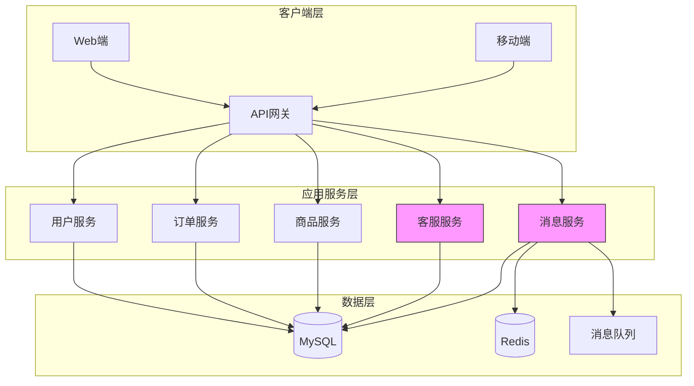

# 阶段 0：基线系统

> 电商客服系统的初始架构设计

## 阶段目标

本阶段定义电商客服系统的基线架构，为后续 AI 增强奠定基础。

- 建立完整的客服业务功能框架
- 设计可扩展的系统架构
- 预留 AI 能力接入的接口与扩展点

---

## 架构设计图



### 核心组件说明

| 组件 | 职责 | 技术选型 |
|------|------|----------|
| API网关 | 请求路由、限流、鉴权 | Spring Cloud Gateway |
| 用户服务 | 用户认证、会员管理 | Spring Boot + JWT |
| 订单服务 | 订单查询、状态管理 | Spring Boot |
| 商品服务 | 商品信息、库存查询 | Spring Boot |
| 客服服务 | 客服会话、工单管理 | Spring Boot |
| 消息服务 | 消息推送、通知 | Spring Boot + Redis |
| MySQL | 持久化存储 | MySQL 8.0 |
| Redis | 缓存、会话存储 | Redis 7.x |
| 消息队列 | 异步消息处理 | RabbitMQ |

---

## 设计决策记录

### 决策 1：采用微服务架构

**选项**：
- 单体架构
- 微服务架构
- 模块化单体

**决策**：微服务架构

**理由**：
1. 客服系统业务边界清晰，适合微服务拆分
2. 订单、商品等服务可复用现有系统
3. 便于后续 AI 能力独立扩展

**风险**：
- 增加了系统复杂性
- 需要服务治理基础设施

---

### 决策 2：客服服务独立部署

**选项**：
- 与其他服务共享
- 独立部署

**决策**：独立部署

**理由**：
1. 客服业务有独特的并发模型（长连接）
2. 便于独立扩展 AI 推理能力
3. 隔离故障域

---

### 决策 3：消息存储采用 MySQL + Redis 混合方案

**选项**：
- 仅 MySQL
- 仅 Redis
- MySQL + Redis

**决策**：MySQL + Redis

**理由**：
- MySQL 保证持久化
- Redis 用于实时消息缓存和发布订阅
- 平衡了性能与可靠性

---

## 权衡分析

### 性能 vs 可扩展性

| 权衡点 | 选择 | 说明 |
|--------|------|------|
| 同步 vs 异步 | 混合模式 | 关键路径同步，非关键路径异步 |
| 缓存策略 | 多级缓存 | 本地缓存 + Redis |
| 数据库连接 | 连接池 | 保障并发能力 |

### 复杂度 vs 可靠性

| 权衡点 | 选择 | 说明 |
|--------|------|------|
| 服务调用 | REST API | 简单可靠，增加一点延迟 |
| 分布式事务 | 最终一致性 | 避免两阶段提交复杂性 |
| 消息可靠性 | 至少一次投递 | 允许重复，不丢消息 |

---

## 可交付设计制品清单

| 制品 | 描述 | 状态 |
|------|------|------|
| 系统架构图 | 整体架构设计 | ✅ |
| API 接口规范 | OpenAPI 3.0 定义 | ✅ |
| 数据库设计 | ER 图、表结构 | ✅ |
| 服务间调用关系 | 调用链路图 | ✅ |
| 部署架构 | 容器化部署方案 | ✅ |
| 客服服务详细设计 | 会话管理、工单流程 | ✅ |

---

## 预留扩展点

为后续 AI 增强预留以下扩展点：

### 1. 消息服务扩展

**预留接口设计：**

```
// AI 消息处理接口（伪代码）
interface AIMessageHandler {
    // 判断是否能处理该消息
    canHandle(message): boolean
    
    // 异步处理消息
    process(message): Promise<Message>
}
```

**设计要点：**
- 定义消息处理的标准契约
- 支持异步处理（AI 调用通常耗时）
- 返回处理结果或转人工的标志

### 2. 客服服务扩展

**预留接入点设计：**

```
// AI 客服适配器（伪代码）
interface AICustomerServiceAdapter {
    // 注册 AI 处理器
    registerAIHandler(handler: AIHandler): void
    
    // 处理用户查询
    handleUserQuery(query: Query): Response
}
```

**设计要点：**
- 抽象 AI 接入点，不影响现有客服流程
- 支持多个 AI 处理器（不同场景用不同模型）
- 保留人工介入的通道

### 3. 数据存储扩展

**预留接口：**
- **向量数据库接入点**：为后续 RAG 预留语义检索能力
- **知识库存储结构**：预留文档、FAQ、对话历史的存储Schema
- **会话上下文存储**：预留多轮对话的状态管理

---

## 与后续阶段对比

| 维度 | 基线系统 | 阶段 1（LLM 接入） |
|------|----------|-------------------|
| 响应方式 | 人工客服 + 规则匹配 | AI 自动回复 |
| 知识获取 | 客服人工查询 | AI 理解后生成 |
| 扩展性 | 受限于人工 | 可横向扩展 |
| 响应速度 | 分钟级 | 秒级 |

---

*本阶段为电商客服系统建立了完整的基础架构，为后续 AI 能力接入奠定了坚实的技术基础。*
