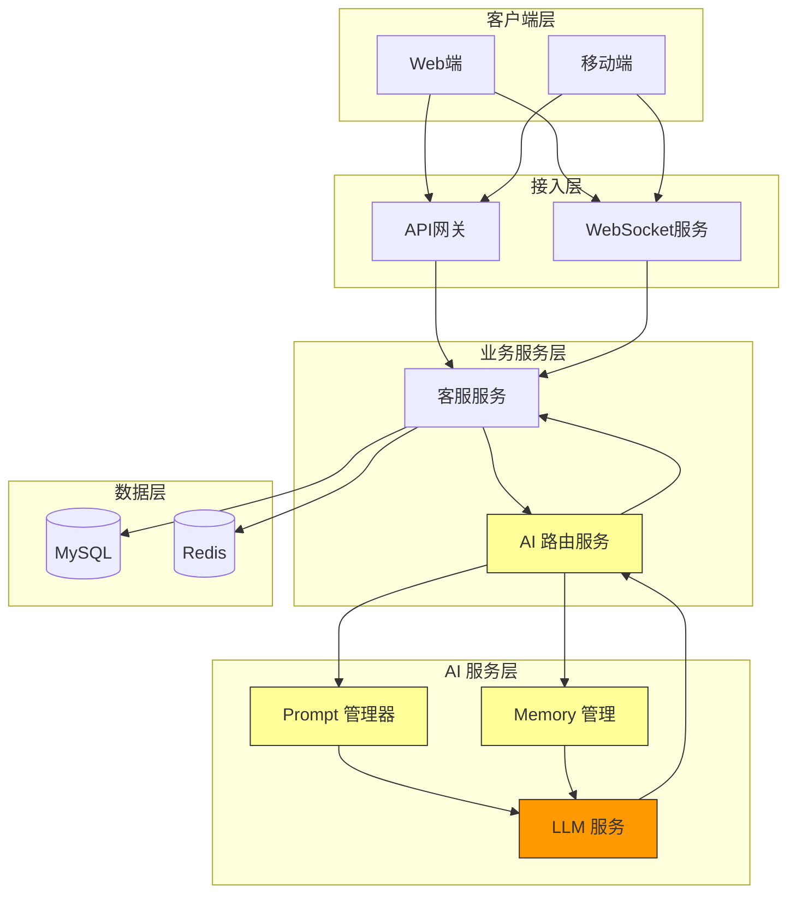

# 阶段 1：AI 问答接入

> 首次将 LLM 能力接入电商客服系统

## 阶段目标

本阶段实现基础的 AI 问答功能，让系统能够自动回答用户问题。

- 接入 LLM 服务，实现基础问答能力
- 设计 Prompt 模板，管理不同场景的问答策略
- 实现简单会话管理，保持对话上下文

---

## 架构设计图



### 核心组件说明

| 组件 | 职责 | 技术选型 |
|------|------|----------|
| AI 路由服务 | 请求分发、LLM 调用封装 | Spring Boot |
| Prompt 管理器 | 模板加载、变量替换 | 自研 |
| Memory 管理 | 会话上下文存储 | Redis |
| LLM 服务 | 大语言模型调用 | OpenAI API / Claude API |
| WebSocket 服务 | 实时消息推送 | Netty / Spring WebSocket |

---

## 设计决策记录

### 决策 1：LLM 服务选型

**选项**：
- OpenAI GPT 系列
- Claude 系列
- 开源模型 (LLaMA, ChatGLM)
- 多个供应商

**决策**：支持多供应商切换，以 OpenAI 为主

**理由**：
1. OpenAI 生态成熟，效果稳定
2. Claude 在某些场景效果更好
3. 支持快速切换，降低供应商依赖风险
4. 预留开源模型接入能力，未来可私有化部署

**风险**：
- API 调用成本控制
- 需要处理不同供应商的 API 差异

---

### 决策 2：Prompt 管理策略

**选项**：
- 硬编码 Prompt
- 配置文件管理
- 数据库存储 + 版本管理

**决策**：数据库存储 + 版本管理

**理由**：
1. 支持运行时修改 Prompt
2. 版本管理便于回滚和 A/B 测试
3. 区分不同场景的 Prompt 模板
4. 记录Prompt 效果数据

---

### 决策 3：会话状态存储

**选项**：
- 无状态（每次请求传递完整上下文）
- 服务端存储会话
- 客户端存储会话 ID

**决策**：服务端存储会话（Redis）

**理由**：
1. 减少客户端传输开销
2. 支持更长的会话历史
3. 便于会话管理和分析
4. Redis 性能满足实时需求

---

## 权衡分析

### 成本 vs 质量

| 权衡点 | 选择 | 说明 |
|--------|------|------|
| 模型选择 | GPT-4o / GPT-4o-mini | 根据问题复杂度自动选择 |
| Token 限制 | 动态裁剪 | 根据会话长度动态调整 |
| 缓存策略 | 相似问题缓存 | 减少重复调用 |

### 延迟 vs 体验

| 权衡点 | 选择 | 说明 |
|--------|------|------|
| 流式输出 | 启用 | 提升用户感知速度 |
| 预加载 | 启用 | 预测用户意图，提前调用 |
| 异步处理 | 可选 | 复杂问题后台处理 |

---

## 可交付设计制品清单

| 制品 | 描述 | 状态 |
|------|------|------|
| LLM 接入架构图 | LLM 集成的整体架构 | ✅ |
| Prompt 模板库 | 场景化 Prompt 模板 | ✅ |
| 会话管理设计 | Memory 存储与检索规范 | ✅ |
| API 接口设计 | AI 问答服务接口 | ✅ |
| 成本控制策略 | Token 限制、缓存策略 | ✅ |
| 异常处理方案 | LLM 调用失败降级 | ✅ |

---

## 与前一阶段对比

### 架构变化

| 维度 | 基线系统 | 阶段 1（LLM 接入） |
|------|----------|-------------------|
| 响应方式 | 人工客服 | AI 自动回复 |
| 对话管理 | 无 | 会话状态存储 |
| 知识获取 | 人工查询 | AI 理解后生成 |
| 扩展性 | 受限于人工 | 可横向扩展 |

### 新增组件

- AI 路由服务（核心 AI 处理单元）
- Prompt 管理器（模板化管理）
- Memory 管理（会话状态）
- LLM 适配器（多供应商支持）

---

## Prompt 模板示例

### 基础客服 Prompt

```
你是电商平台的智能客服助手。
你的职责是帮助用户解答问题，提供优质的服务体验。

当前对话历史：
{history}

用户问题：{query}

请根据对话历史和问题，给出专业、友好的回答。
如果问题涉及订单、物流等，请引导用户提供必要信息。
```

### 意图识别 Prompt

```
分析用户问题的意图，输出 JSON 格式：

用户问题：{query}

可能的意图：
- 订单查询
- 物流咨询
- 退换货
- 产品咨询
- 支付问题
- 其他

请输出最可能的意图和置信度。
```

---

## 后续演进方向

本阶段实现了基础的 AI 问答能力，但存在以下局限：

1. **知识局限**：LLM 训练数据有时效限制，可能回答错误
2. **幻觉问题**：LLM 可能生成不准确信息
3. **无法操作**：只能回答问题，不能执行操作

这些局限将在后续阶段逐步解决：
- 阶段 2：RAG 增强（解决知识局限）
- 阶段 3：Agent 化（增加自主能力）
- 阶段 4：Tool 集成（支持实际操作）

---

*阶段 1 为系统注入了 AI 能力，实现了从 0 到 1 的突破。*
