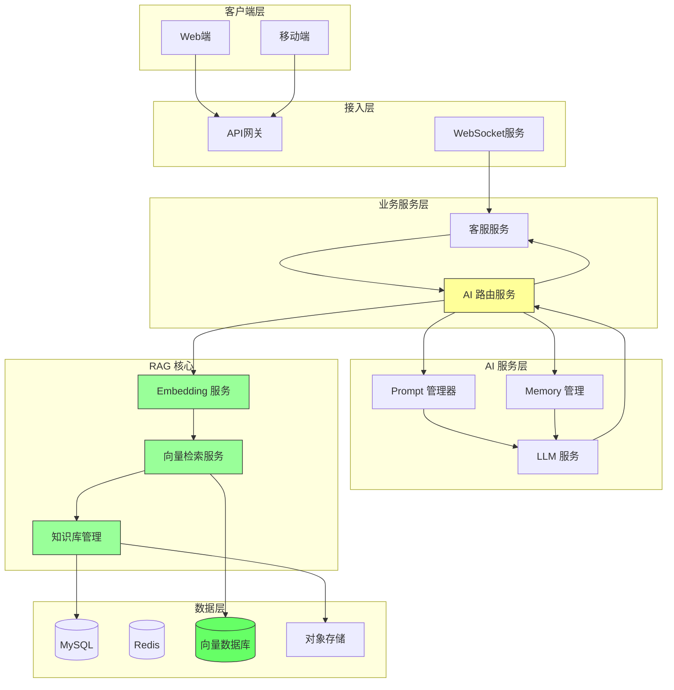
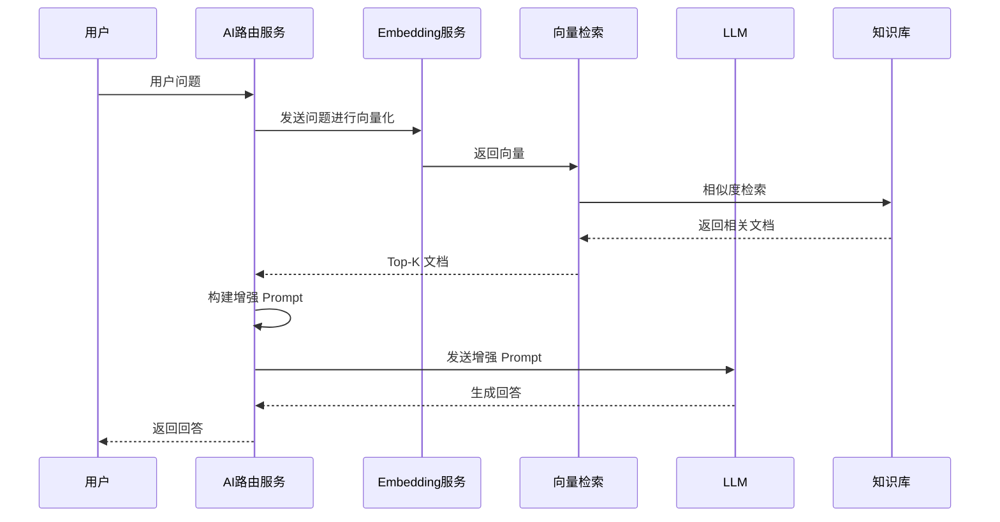

# 阶段 2：RAG 增强

> 引入检索增强生成，解决知识时效性和准确性问

## 阶段目标

本阶段引入 RAG（Retrieval Augmented Generation）架构，提升 AI 回答的准确性和可靠性。

- 构建企业知识库，存储产品信息、政策文档等
- 实现向量检索，理解用户问题的语义
- 将检索结果融入 Prompt，提升回答质量

---

## 架构设计图

### 核心组件说明

| 组件 | 职责 | 技术选型 |
|------|------|----------|
| Embedding 服务 | 文本向量化 | OpenAI Embedding / 本地模型 |
| 向量检索服务 | 相似度检索 | Milvus / Qdrant |
| 知识库管理 | 文档加载、分片、索引 | 自研 |
| 向量数据库 | 高维向量存储与检索 | Milvus |

---

## 设计决策记录

### 决策 1：向量数据库选型

**选项**：
- Milvus
- Qdrant
- Weaviate
- pgvector (PostgreSQL 插件)

**决策**：Milvus（支持云端和私有化部署）

**理由**：
1. 功能完善，支持多种索引类型
2. 云端托管，降低运维成本
3. 社区活跃，文档丰富
4. 支持大规模向量检索

**风险**：
- 需要维护 Milvus 集群
- 冷数据存储成本

---

### 决策 2：文档分块策略

**选项**：
- 固定分块（固定字数/句子数）
- 语义分块（按段落/主题）
- 递归分块（层次化分块）

**决策**：递归分块 + 动态调整

**理由**：
1. 电商场景文档类型多样
2. 固定分块可能破坏语义完整性
3. 递归分块可根据内容类型自适应
4. 保留块之间的关联信息

---

### 决策 3：检索策略

**选项**：
- 纯向量检索
- 关键词检索 + 向量检索
- 混合检索（BM25 + 向量）

**决策**：混合检索

**理由**：
1. 向量检索擅长语义匹配
2. 关键词检索确保精确匹配
3. 混合策略平衡精确性和泛化能力
4. 支持不同类型的查询

---

## 权衡分析

### 质量 vs 成本

| 权衡点 | 选择 | 说明 |
|--------|------|------|
| Embedding 模型 | text-embedding-3-small | 平衡效果与成本 |
| 向量维度 | 1536 维 | 标准维度，平衡精度与存储 |
| 检索数量 | Top 5-10 | 根据效果动态调整 |
| 重排模型 | 轻量级 | 仅对候选集重排 |

### 延迟 vs 准确性

| 权衡点 | 选择 | 说明 |
|--------|------|------|
| 检索超时 | 500ms | 快速失败，降级到纯 LLM |
| 并行处理 | 检索 + 生成并行 | 隐藏延迟 |
| 缓存策略 | 热门问题缓存结果 | 减少重复计算 |

---

## 可交付设计制品清单

| 制品 | 描述 | 状态 |
|------|------|------|
| RAG 系统架构图 | 完整 RAG 架构设计 | ✅ |
| 知识库设计 | 文档类型、分块策略 | ✅ |
| 检索策略文档 | 混合检索配置 | ✅ |
| 索引构建流程 | 增量与全量构建方案 | ✅ |
| 效果评估方案 | 准确率、召回率评估 | ✅ |
| 知识库管理后台 | 文档上传、审核、监控 | ✅ |

---

## 与前一阶段对比

### 架构变化

| 维度 | 阶段 1（LLM 接入） | 阶段 2（RAG 增强） |
|------|-------------------|-------------------|
| 知识来源 | LLM 训练数据 | 企业知识库 |
| 回答准确性 | 可能幻觉 | 基于检索结果 |
| 时效性 | 受限于训练数据 | 可实时更新 |
| 检索能力 | 无 | 向量 + 关键词 |

### 新增组件

- Embedding 服务（文本向量化）
- 向量检索服务（语义搜索）
- 知识库管理（文档处理）
- 向量数据库（Milvus）

---

## RAG 工作流程

---

## 知识库内容规划

### 电商客服知识库分类

| 知识类型 | 示例内容 | 更新频率 |
|----------|----------|----------|
| 产品信息 | 商品详情、规格、参数 | 实时 |
| 政策规则 | 退换货政策、隐私政策 | 月度 |
| 常见问题 | FAQ、标准化问答 | 周度 |
| 物流信息 | 快递公司、时效 | 实时 |
| 活动信息 | 促销活动、优惠券 | 实时 |

---

## 后续演进方向

RAG 增强了知识获取能力，但系统仍是被动响应模式。

阶段 3 将引入 Agent 架构，赋予系统自主推理和规划能力。

---

*RAG 阶段让 AI 回答从"猜测"变为"有据可依"，大幅提升了回答的可靠性。*
