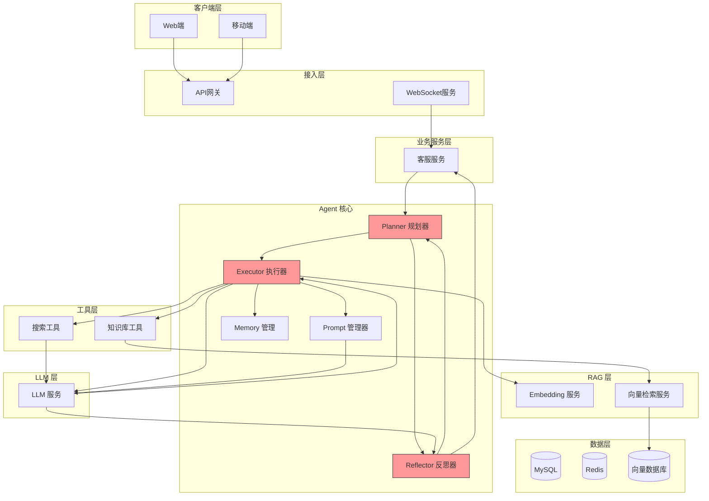
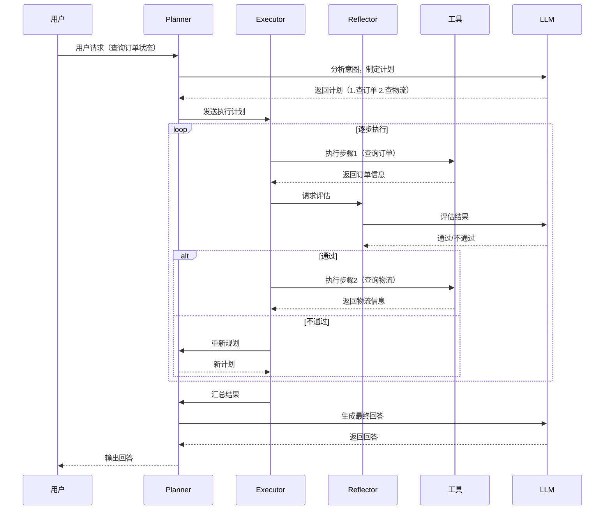

# 阶段 3：Agent 化升级

> 引入 Agent 架构，赋予系统自主推理和规划能力

## 阶段目标

本阶段引入 Agent 架构，实现从"被动应答"到"主动规划"的跨越。

- 实现 ReAct 推理模式，让 Agent 能够进行多步推理
- 设计自主决策流程，处理复杂用户请求
- 建立反思机制，提升回答质量

---

## 架构设计图

### 核心组件说明

| 组件 | 职责 | 技术选型 |
|------|------|----------|
| Planner 规划器 | 分析用户意图，制定执行计划 | LLM + 结构化输出 |
| Executor 执行器 | 依次执行计划中的步骤 | 自研 Agent 框架 |
| Reflector 反思器 | 评估执行结果，决定是否重试 | LLM 评估 |
| Memory 管理 | 短期记忆（当前任务）+ 长期记忆 | Redis |

---

## 设计决策记录

### 决策 1：Agent 架构选择

**选项**：
- ReAct (Reasoning + Acting)
- CoT (Chain of Thought)
- Toolformer
- 自主 Agent

**决策**：ReAct + 反思机制

**理由**：
1. ReAct 模式可解释性强，便于调试
2. 反思机制提升回答准确性
3. 结合 RAG 效果更好
4. 业界成熟方案，风险可控

---

### 决策 2：执行策略

**选项**：
- 单轮执行（一次性生成完整计划）
- 逐步执行（每步执行后评估）
- 并行执行（独立步骤并行）

**决策**：逐步执行 + 关键步骤并行

**理由**：
1. 逐步执行确保每步正确性
2. 独立步骤可并行，提升效率
3. 支持动态调整计划

---

### 决策 3：反思触发条件

**选项**：
- 每次执行后反思
- 仅在失败时反思
- 基于置信度的自适应

**决策**：基于置信度的自适应

**理由**：
1. 减少不必要的反思，降低延迟
2. 关键决策点强制反思
3. 可配置不同场景的策略

---

## 权衡分析

### 能力 vs 延迟

| 权衡点 | 选择 | 说明 |
|--------|------|------|
| 反思轮次 | 最多 2 轮 | 平衡质量与延迟 |
| 执行超时 | 30 秒 | 防止无限循环 |
| 并行步骤 | 最多 3 个 | 平衡并发与资源 |

### 复杂度 vs 可控性

| 权衡点 | 选择 | 说明 |
|--------|------|------|
| 计划复杂度 | 最多 5 步 | 防止计划过于复杂 |
| 工具调用深度 | 最多 3 层 | 防止调用链过长 |
| 日志详细度 | 完整记录 | 便于问题排查 |

---

## 可交付设计制品清单

| 制品 | 描述 | 状态 |
|------|------|------|
| Agent 系统架构图 | 完整 Agent 架构 | ✅ |
| ReAct 工作流设计 | 推理与执行流程 | ✅ |
| 反思机制设计 | 结果评估与重试策略 | ✅ |
| 状态机设计 | Agent 状态管理 | ✅ |
| 监控指标设计 | 执行时长、成功率等 | ✅ |
| 异常处理方案 | 超时、失败处理 | ✅ |

---

## 与前一阶段对比

### 能力提升

| 维度 | 阶段 2（RAG 增强） | 阶段 3（Agent 化） |
|------|-------------------|-------------------|
| 响应模式 | 被动应答 | 主动规划 |
| 任务复杂度 | 简单问答 | 复杂多步任务 |
| 推理能力 | 无 | 多步推理 |
| 自我纠正 | 无 | 反思机制 |
| 执行效率 | 单次调用 | 可并行、可重试 |

### 架构变化

- 新增 Planner（规划器）
- 新增 Executor（执行器）
- 新增 Reflector（反思器）
- 工具调用从直接调用变为通过 Executor

---

## Agent 工作流程

---

## 场景示例

### 场景：查询订单并推荐售后方案

**用户请求**：
> 我的订单号是 123456，一直没有收到货，请问我可以申请退款吗？

**Agent 推理过程**：

1. **意图理解**：用户想了解订单状态，并咨询退款可能性
2. **制定计划**：
   - 步骤1：查询订单详情（订单号 123456）
   - 步骤2：查询物流状态
   - 步骤3：根据订单和物流情况，判断是否可以退款
   - 步骤4：生成回答
3. **执行计划**：
   - 调用订单服务查询订单 → 订单状态：已发货
   - 调用物流服务查询物流 → 物流显示：运输中
   - 根据物流状态，判断符合退款条件
4. **生成回答**：订单已发货且物流运输中，如果超过预计送达时间 7 天，可以申请退款。

---

## 后续演进方向

Agent 阶段赋予了系统自主推理能力，但工具调用需要显式定义。

阶段 4 将引入 Tool 集成，让系统能够调用现有业务系统的 API，实现真正的自动化。

---

*Agent 化升级让客服系统从"应答机器"进化为"智能助手"，能够处理更复杂的用户需求。*
