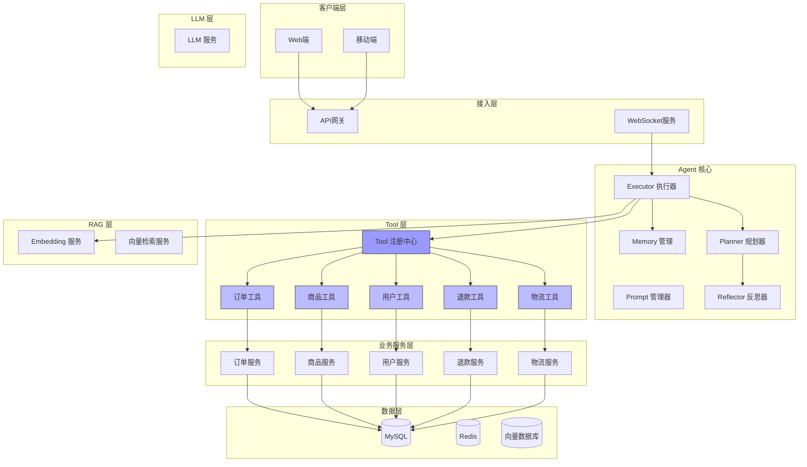
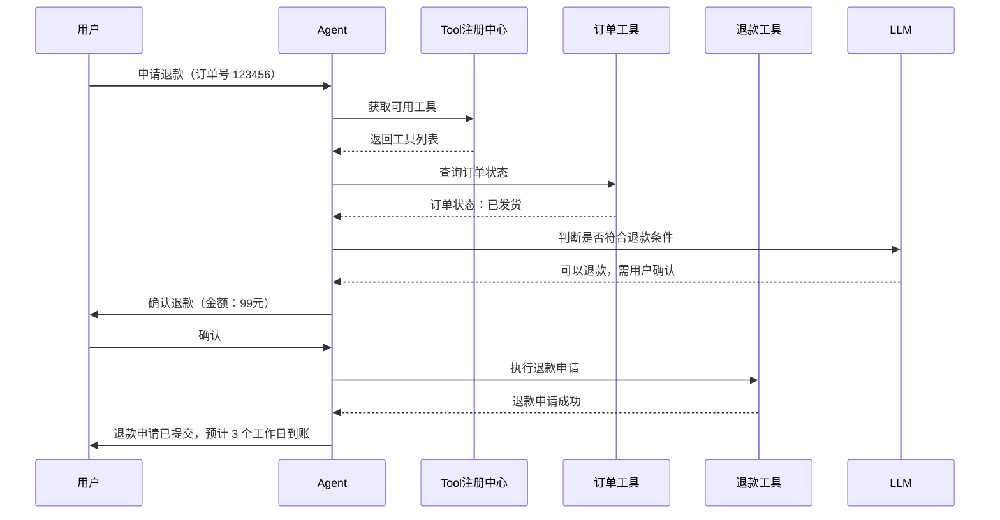

# 阶段 4：Tool 集成

> 集成业务系统 API，实现自动化操作能力

## 阶段目标

本阶段将 Agent 与业务系统深度集成，让 AI 不仅能回答问题，还能执行实际操作。

- 定义标准 Tool 接口规范
- 集成订单、商品、用户等核心服务
- 实现权限控制和操作审计

---

## 架构设计图



### 核心组件说明

| 组件 | 职责 | 技术选型 |
|------|------|----------|
| Tool 注册中心 | 工具注册、发现、版本管理 | 自研 |
| 订单工具 | 订单查询、状态更新等 | 封装订单服务 API |
| 商品工具 | 商品查询、库存查询等 | 封装商品服务 API |
| 用户工具 | 用户信息查询等 | 封装用户服务 API |
| 退款工具 | 退款申请、退款处理等 | 封装退款服务 API |
| 物流工具 | 物流查询等 | 封装物流服务 API |

---

## 设计决策记录

### 决策 1：Tool 接口规范

**选项**：
- OpenAI Function Calling 格式
- 自定义 JSON Schema
- gRPC 接口定义

**决策**：兼容 OpenAI Function Calling + 自定义扩展

**理由**：
1. 主流 LLM 原生支持
2. 便于模型理解工具能力
3. 支持自定义参数校验
4. 便于监控和审计

---

### 决策 2：权限控制策略

**选项**：
- 无限制（Agent 可执行任何操作）
- 固定权限（预定义权限列表）
- 运行时权限（根据用户身份动态决定）

**决策**：运行时权限 + 操作审批

**理由**：
1. 保护用户数据安全
2. 敏感操作需要用户确认
3. 支持细粒度权限配置
4. 符合业务合规要求

---

### 决策 3：操作安全性

**选项**：
- 仅查询操作
- 所有操作都可执行
- 危险操作需要人工审批

**决策**：分类处理 + 人工审批

**理由**：
1. 查询操作风险低，可自动执行
2. 写入操作需要谨慎处理
3. 危险操作（退款、取消订单）需要人工确认
4. 保护业务和用户利益

---

## 权衡分析

### 自动化 vs 安全性

| 权衡点 | 选择 | 说明 |
|--------|------|------|
| 查询操作 | 自动执行 | 用户无感，快速响应 |
| 修改操作 | 自动执行 + 日志 | 记录操作轨迹 |
| 敏感操作 | 需要确认 | 保护用户权益 |
| 危险操作 | 人工审批 | 防止误操作 |

### 功能 vs 复杂度

| 权衡点 | 选择 | 说明 |
|--------|------|------|
| Tool 数量 | 逐步增加 | 从核心工具开始 |
| 并发控制 | 单用户串行 | 防止状态冲突 |
| 超时处理 | 重试 + 降级 | 保证系统可用性 |

---

## 可交付设计制品清单

| 制品 | 描述 | 状态 |
|------|------|------|
| Tool 接口规范 | 标准化工具定义格式 | ✅ |
| Tool 注册中心设计 | 工具注册与发现机制 | ✅ |
| 权限控制设计 | 操作权限体系 | ✅ |
| 操作审计设计 | 操作日志与追溯 | ✅ |
| 集成清单 | 各业务系统集成方案 | ✅ |
| 安全策略 | 危险操作防护机制 | ✅ |

---

## 与前一阶段对比

### 能力提升

| 维度 | 阶段 3（Agent 化） | 阶段 4（Tool 集成） |
|------|-------------------|-------------------|
| 操作能力 | 仅回答问题 | 可执行实际操作 |
| 数据获取 | 静态知识库 | 实时业务数据 |
| 用户服务 | 被动响应 | 主动服务 |
| 自动化程度 | 低 | 高 |

### 架构变化

- 新增 Tool 注册中心
- 新增订单、商品、用户、退款、物流工具
- 业务服务从查询为主扩展到可写操作

---

## Tool 定义示例

### 订单查询工具

```json
{
  "name": "get_order_detail",
  "description": "根据订单号查询订单详细信息",
  "parameters": {
    "type": "object",
    "properties": {
      "order_id": {
        "type": "string",
        "description": "订单号"
      }
    },
    "required": ["order_id"]
  }
}
```

### 退款申请工具

```json
{
  "name": "apply_refund",
  "description": "申请订单退款",
  "parameters": {
    "type": "object",
    "properties": {
      "order_id": {
        "type": "string",
        "description": "订单号"
      },
      "reason": {
        "type": "string",
        "description": "退款原因"
      },
      "amount": {
        "type": "number",
        "description": "退款金额"
      }
    },
    "required": ["order_id", "reason"]
  }
}
```

---

## 工作流程示例

### 场景：自动处理退款请求



---

## 权限控制示例

### Tool 调用权限矩阵

| Tool 类型 | 示例 | 普通用户 | 客服 | 管理员 |
|-----------|------|----------|------|--------|
| 查询 | get_order_detail | 仅自己的订单 | 所有订单 | 所有订单 |
| 修改 | update_address | 需确认 | 需确认 | 直接执行 |
| 敏感 | apply_refund | 需确认 | 需确认 | 需审批 |
| 危险 | cancel_order | 禁止 | 需审批 | 需审批 |

---

## 后续演进方向

Tool 集成阶段实现了业务操作的自动化，但系统间的集成还不够紧密。

阶段 5 将整合所有能力，构建完整的 AI 增强客服系统，包括完整的工程化考量。

---

*Tool 集成让 AI 客服从"能说会道"进化到"能说会做"，真正实现了自动化服务。*
