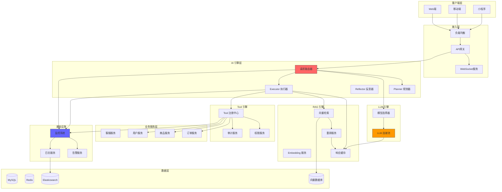

# 阶段 5：完整 AI 增强系统

> 整合所有能力，构建生产级 AI 客服系统

## 阶段目标

本阶段整合前四个阶段的所有能力，并添加完整的工程化考量，构建生产级的 AI 客服系统。

- 整合 LLM、RAG、Agent、Tool 四大能力
- 实现完整的监控、告警、成本控制
- 确保系统的高可用性和安全性

---

## 架构设计图



### 核心组件说明

| 组件 | 职责 | 技术选型 |
|------|------|----------|
| 请求路由器 | 请求分发、流量控制 | 自研 |
| 模型选择器 | 根据问题类型选择合适模型 | 规则 + LLM |
| LLM 连接池 | 复用连接，降低延迟 | 自研 |
| 重排服务 | 对检索结果进行二次排序 | BGE-Reranker |
| RAG 缓存 | 缓存检索结果，减少重复计算 | Redis |
| 响应缓存 | 缓存相同问题的回答 | Redis |
| 权限服务 | Tool 调用权限控制 | 自研 |
| 审计服务 | 记录所有操作日志 | 自研 |
| 监控系统 | 指标采集与展示 | Prometheus + Grafana |
| 告警服务 | 异常告警通知 | 钉钉/飞书/邮件 |

---

## 设计决策记录

### 决策 1：多模型组合策略

**选项**：
- 仅使用顶级模型
- 仅使用低成本模型
- 多模型动态组合

**决策**：多模型动态组合

**理由**：
1. 简单问题用小模型，降低成本
2. 复杂问题用大模型，保证质量
3. 支持 A/B 测试和渐进式切换
4. 便于私有化部署替换

---

### 决策 2：缓存策略

**选项**：
- 无缓存
- 仅缓存回答
- 缓存回答 + 检索结果

**决策**：多级缓存

**理由**：
1. 缓存回答：减少 LLM 调用
2. 缓存检索结果：减少 RAG 延迟
3. 缓存过期时间根据内容类型动态调整
4. 支持缓存失效和预热

---

### 决策 3：高可用架构

**选项**：
- 单实例
- 主备
- 多活

**决策**：多实例 + 限流 + 熔断

**理由**：
1. AI 服务成本高，不需要多活
2. 限流保护后端 LLM 服务
3. 熔断防止级联故障
4. 成本与可用性平衡

---

## 完整工程化考量

### 1. 成本控制

| 维度 | 策略 | 实现方式 |
|------|------|----------|
| Token 成本 | 按问题类型分流 | 简单问题用 mini 模型 |
| 请求成本 | 请求去重 | 相同问题缓存响应 |
| 存储成本 | 分级存储 | 热数据 Redis，冷数据磁盘 |
| 计算成本 | 批量处理 | 闲时批量更新知识库 |

### 2. 延迟优化

| 维度 | 策略 | 实现方式 |
|------|------|----------|
| 首 Token 延迟 | 流式输出 | WebSocket 实时推送 |
| 检索延迟 | 预检索 | 根据用户历史预测意图 |
| 生成延迟 | 异步处理 | 复杂问题后台处理 |

### 3. 安全防护

| 维度 | 策略 | 实现方式 |
|------|------|----------|
| 注入攻击 | 输入过滤 | 敏感词检测 + 转义 |
| 越权访问 | 权限校验 | Tool 调用身份验证 |
| 数据泄露 | 输出过滤 | 敏感信息脱敏 |

### 4. 可观测性

| 维度 | 指标 | 告警阈值 |
|------|------|----------|
| 可用性 | 请求成功率 | < 99% 告警 |
| 延迟 | P99 响应时间 | > 10s 告警 |
| 成本 | Token 消耗 | 环比增长 50% 告警 |
| 质量 | 用户满意度 | < 4.0 评分告警 |

---

## 可交付设计制品清单

| 制品 | 描述 | 状态 |
|------|------|------|
| 完整系统架构图 | 端到端架构设计 | ✅ |
| 部署架构 | K8s 部署方案 | ✅ |
| 监控告警方案 | 指标、告警、仪表盘 | ✅ |
| 成本控制方案 | 费用分析和优化策略 | ✅ |
| 安全防护方案 | 安全加固措施 | ✅ |
| 运维手册 | 部署、扩容、故障处理 | ✅ |
| SLA 协议 | 服务等级协议 | ✅ |

---

## 与前一阶段对比

### 完整度提升

| 维度 | 阶段 4（Tool 集成） | 阶段 5（完整系统） |
|------|-------------------|-------------------|
| AI 能力 | 基础整合 | 深度优化 |
| 工程化 | 初始 | 完整 |
| 监控 | 基本指标 | 全面可观测 |
| 成本控制 | 人工 | 自动化 |
| 高可用 | 基础 | 企业级 |

### 关键升级

- 多模型动态组合
- 多级缓存策略
- 完整监控告警体系
- 自动化成本控制
- 企业级安全防护

---

## 演进路线总结

```
┌─────────────────────────────────────────────────────────┐
│                    AI 增强客服系统                        │
├─────────────────────────────────────────────────────────┤
│  阶段0     阶段1      阶段2      阶段3      阶段4     阶段5 │
│ 基线系统 → LLM接入 → RAG增强 → Agent化 → Tool集成 → 完整系统│
├─────────────────────────────────────────────────────────┤
│  传统客服   AI问答     知识增强    自主推理    业务集成   生产级  │
│                                                          │
│  人工响应   基础问答   有据可依    复杂处理    自动操作   高可用  │
└─────────────────────────────────────────────────────────┘
```

### 各阶段核心价值

| 阶段 | 核心价值 | 业务收益 |
|------|----------|----------|
| 0 | 基础架构 | 稳定可靠 |
| 1 | AI 问答 | 7×24 服务 |
| 2 | 知识增强 | 回答准确 |
| 3 | 智能推理 | 复杂问题处理 |
| 4 | 自动化 | 效率提升 |
| 5 | 生产级 | 成本可控 |

---

## 未来展望

系统已完成初始建设，未来可持续优化：

1. **模型升级**：跟进最新大模型技术
2. **知识丰富**：扩展知识库覆盖范围
3. **场景拓展**：从客服延伸到营销、推荐
4. **多模态**：支持图片、语音交互
5. **私有化**：支持私有化部署方案

---

*恭喜！经过 5 个阶段的演进，电商客服系统已从传统模式进化为完整的 AI 增强系统。*

*这是起点，不是终点。AI 技术日新月异，持续学习和迭代是关键。*
