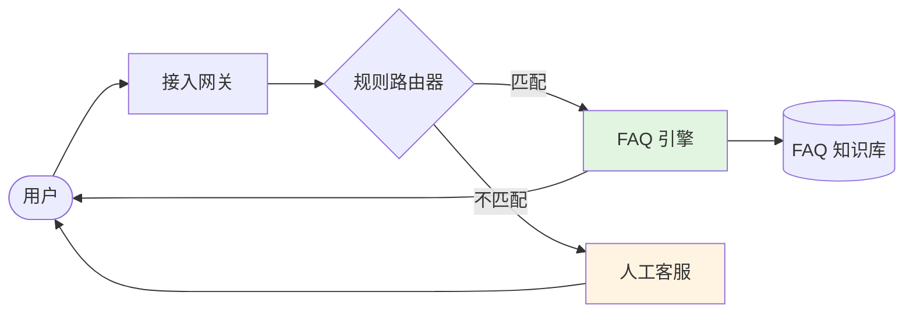
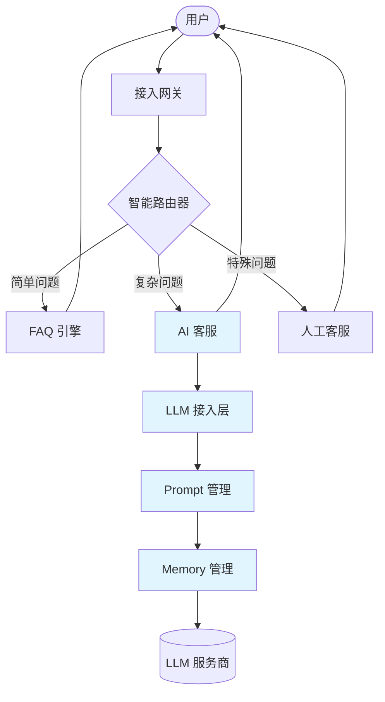
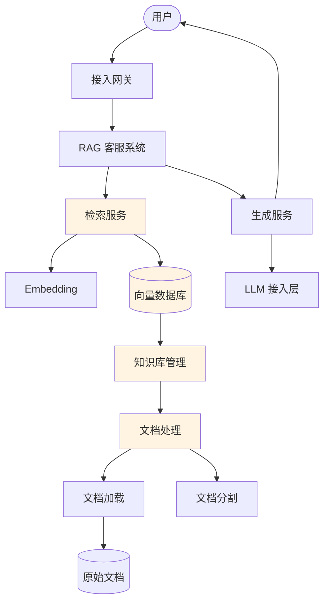
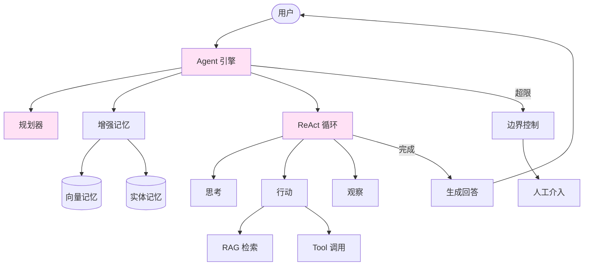
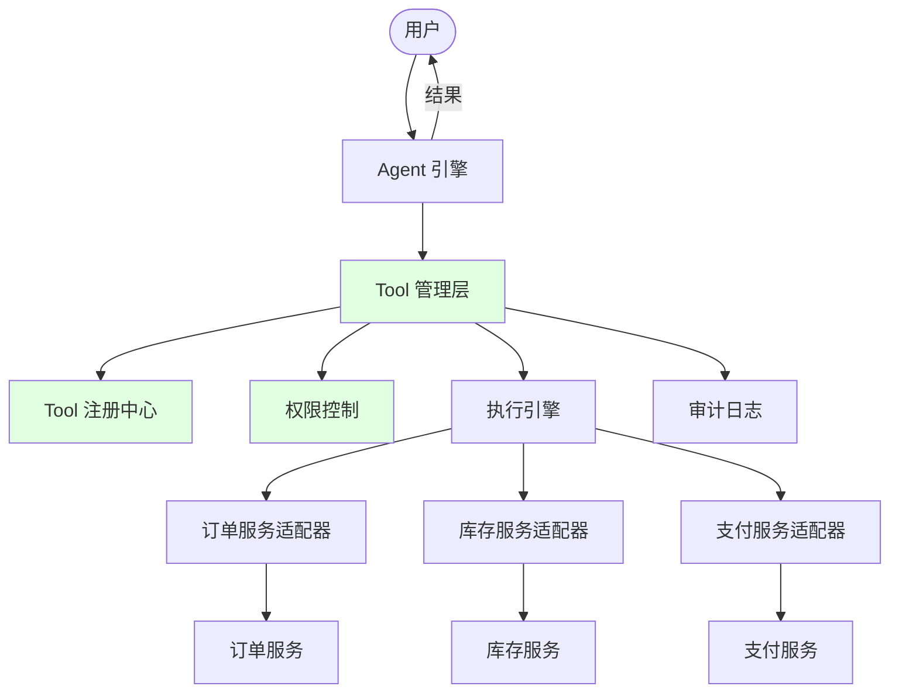
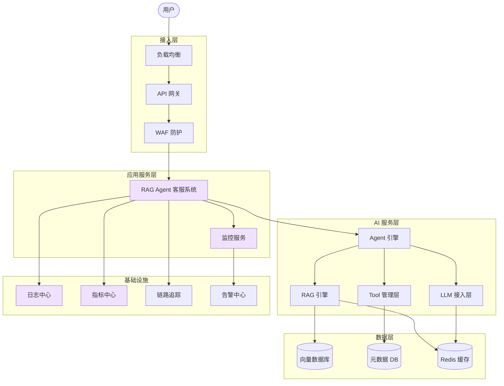

# 课程主线演进路径

> System Evolution Path：从传统系统到 AI 增强系统的渐进式设计演进

## 演进概述

本课程以**电商客服系统**为主线案例，展示如何从传统规则-based 系统逐步演进为 AI 增强系统。

**演进阶段：**

```
阶段 0：基线系统（传统规则）
    ↓ 痛点识别 + 技术选型
阶段 1：AI 问答接入（1.1-1.3）
    ↓ 知识增强
阶段 2：RAG 设计（1.4）
    ↓ 自主决策
阶段 3：Agent 化升级（1.5）
    ↓ 系统操作
阶段 4：Tool 集成（1.6）
    ↓ 工程化完善
阶段 5：完整 AI 增强系统（1.7）
```

---

## 阶段 0：基线系统（课程前状态）

### 系统描述

传统规则-based 客服系统

**核心能力：**
- 基于关键词匹配的问题分类
- 固定 FAQ 模板回答
- 无法处理开放式问题
- 人工客服转接机制

**技术架构：**
```
用户提问
    ↓
关键词匹配
    ↓
规则引擎
    │
    ├── 匹配成功 → 返回模板回答
    │
    └── 匹配失败 → 转人工客服
```

**痛点分析：**

| 痛点 | 描述 | 影响 |
|------|------|------|
| 覆盖率有限 | 只能回答预设问题 | 大量问题需转人工 |
| 维护成本高 | 新 FAQ 需人工编写 | 响应慢，成本高 |
| 体验差 | 机械式回答 | 用户满意度低 |
| 扩展困难 | 规则难以复用 | 多业务线成本高 |

### 基线架构图



### 基线系统评估

| 维度 | 评分 | 说明 |
|------|------|------|
| 覆盖率 | ⭐⭐ | 仅预设问题 |
| 准确率 | ⭐⭐⭐⭐ | 规则明确时准确 |
| 响应速度 | ⭐⭐⭐⭐⭐ | 毫秒级 |
| 成本 | ⭐⭐⭐⭐ | 人工成本低 |
| 可扩展性 | ⭐⭐ | 规则难以扩展 |
| 用户体验 | ⭐⭐ | 机械、不灵活 |

### 可交付设计制品

**文档 1：基线系统架构设计**
- 系统架构图
- 组件职责说明
- 数据流图

**文档 2：痛点与机会分析**
- 痛点清单与影响评估
- AI 增强机会识别
- ROI 估算

---

## 阶段 1：AI 问答接入（对应 1.1-1.3）

### 升级目标

接入 LLM 基础能力，实现开放式问答

### 架构变化

```
阶段 0：用户 → 规则引擎 → FAQ/人工

阶段 1：用户 → 智能路由 → AI 客服/规则引擎/人工
                ↓
            LLM 接入层
                ↓
            Prompt 管理
                ↓
            Memory 管理
```

### 新增组件

| 组件 | 功能 | 技术要点 |
|------|------|----------|
| 智能路由器 | 判断问题类型，选择处理路径 | 分类模型/规则 |
| LLM 接入层 | 统一接入多种 LLM | 重试、降级、路由 |
| Prompt 管理 | 模板化、版本控制 | 工程化设计 |
| Memory 管理 | 对话上下文维护 | Window/Summary 策略 |

### 阶段 1 架构图



### 设计决策点

**决策 1：同步 vs 异步调用**
- 选择：同步调用 + 流式输出
- 理由：用户体验优先，简单问答 1-2 秒可接受

**决策 2：Prompt 模板策略**
- 选择：分层模板（系统层 + 业务层 + 场景层）
- 理由：复用性 + 灵活性平衡

**决策 3：Memory 策略**
- 选择：Window Memory（保留最近 10 轮）
- 理由：简单场景，控制成本

### 权衡点分析

| 权衡 | 选项 A | 选项 B | 决策 | 理由 |
|------|--------|--------|------|------|
| 成本 vs 质量 | GPT-4（贵但好） | GPT-3.5（便宜） | GPT-3.5 为主 | 简单问答足够 |
| 延迟 vs 体验 | 完整生成后返回 | 流式输出 | 流式输出 | 体验优先 |
| 记忆 vs 成本 | 长记忆 | 短记忆 | 10 轮 Window | 成本可控 |

### 可交付设计制品

**文档 1：LLM 接入层架构设计**
- 分层架构图
- 调用模式决策树
- 重试降级策略设计

**文档 2：Prompt 工程化设计**
- 模板规范
- 版本管理流程
- 测试策略

**文档 3：Memory 策略选型文档**
- Memory 类型对比
- 选型决策
- Session 管理设计

---

## 阶段 2：RAG 设计（对应 1.4）

### 升级目标

增强知识检索能力，实现基于知识库的精准问答

### 架构变化

```
阶段 1：用户问题 → LLM 直接回答

阶段 2：用户问题 → 语义检索 → 相关知识 → LLM 增强回答
                              ↓
                        向量数据库（商品知识库）
```

### 新增组件

| 组件 | 功能 | 技术要点 |
|------|------|----------|
| 向量数据库 | 存储文档向量 | Pinecone/Milvus |
| Embedding 服务 | 文本向量化 | text-embedding-ada-002 |
| 检索服务 | 语义相似度检索 | Top-K、重排序 |
| 知识库管理 | 文档导入、更新 | 增量更新、版本控制 |
| 文档处理 | 加载、分割、清洗 | Chunk 策略 |

### 阶段 2 架构图



### 设计决策点

**决策 1：向量数据库选型**
- 选择：Pinecone（托管）+ pgvector（本地缓存）
- 理由：托管省心 + 本地加速

**决策 2：文档分割策略**
- 选择：按段落分割，Chunk Size 400，Overlap 50
- 理由：商品文档结构清晰，保留上下文

**决策 3：检索策略**
- 选择：Top-5 检索 + 相似度阈值 0.7
- 理由：平衡召回率与精度

### 权衡点分析

| 权衡 | 选项 A | 选项 B | 决策 | 理由 |
|------|--------|--------|------|------|
| 托管 vs 自建 | Pinecone | Milvus 自建 | Pinecone | 运维成本低 |
| 检索精度 | 严格阈值 | 宽松阈值 | 0.7 | 避免噪音 |
| 更新频率 | 实时 | 定时 | 每小时 | 平衡成本与时效 |

### 可交付设计制品

**文档 1：RAG 系统架构设计图**
- 完整架构图（数据准备 + 查询 + 生成）
- 组件职责说明
- 数据流图

**文档 2：知识库设计文档**
- 文档分割策略
- Embedding 配置
- 向量数据库选型
- 更新机制

**文档 3：检索策略决策矩阵**
- Top-K 选择
- 相似度阈值
- 重排序策略

---

## 阶段 3：Agent 化升级（对应 1.5）

### 升级目标

实现自主决策，处理复杂多步任务

### 架构变化

```
阶段 2：用户问题 → 检索 → 生成回答

阶段 3：用户问题 → Agent 决策 → 思考 → 行动 → 观察 → ... → 回答
                                    ↓
                              可能多次检索/调用 Tool
```

### 新增组件

| 组件 | 功能 | 技术要点 |
|------|------|----------|
| Agent 引擎 | ReAct 循环管理 | Thought-Action-Observation |
| 规划器 | 任务分解与规划 | 意图识别、步骤规划 |
| 记忆增强 | 长期记忆存储 | Vector Memory + Entity Memory |
| 边界控制 | 步数/时间/成本限制 | 熔断机制 |

### 阶段 3 架构图



### 设计决策点

**决策 1：Agent vs Workflow**
- 选择：混合模式（确定流程用 Workflow，探索性任务用 Agent）
- 理由：平衡可控性与灵活性

**决策 2：ReAct 循环边界**
- 选择：最大 10 步，超时 30 秒
- 理由：防止无限循环，控制成本

**决策 3：记忆策略**
- 选择：Vector Memory（长期）+ Entity Memory（关键实体）
- 理由：记住跨会话信息

### 权衡点分析

| 权衡 | 选项 A | 选项 B | 决策 | 理由 |
|------|--------|--------|------|------|
| 自主 vs 可控 | 完全自主 | 完全可控 | 混合 | 安全优先 |
| 记忆时长 | 单会话 | 永久 | 30 天 | 隐私与体验平衡 |
| 成本 vs 能力 | GPT-4 | GPT-3.5 | 动态选择 | 复杂任务用 GPT-4 |

### 可交付设计制品

**文档 1：Agent 系统架构图**
- ReAct 循环流程图
- 组件职责说明
- 与 Workflow 边界定义

**文档 2：ReAct 决策流程设计**
- Thought-Action-Observation 循环
- 工具使用策略
- 边界控制设计

**文档 3：Agent 边界设计文档**
- 步数/时间/成本限制
- 人工介入触发条件
- 降级策略

---

## 阶段 4：Tool 集成（对应 1.6）

### 升级目标

集成现有系统 API，实现系统操作能力

### 架构变化

```
阶段 3：Agent 可以思考、检索知识

阶段 4：Agent 可以操作（查订单、办退款、改地址）
              ↓
        订单服务 / 库存服务 / 支付服务 / ...
```

### 新增组件

| 组件 | 功能 | 技术要点 |
|------|------|----------|
| Tool 注册中心 | Tool 发现与注册 | Schema 管理 |
| Tool 适配层 | API 抽象为 Tool | 语义化封装 |
| 权限控制 | Tool 调用权限 | 用户/数据/操作权限 |
| 执行引擎 | Tool 调用执行 | 参数验证、错误处理 |
| 审计日志 | 记录所有 Tool 调用 | 安全审计 |

### 阶段 4 架构图



### 设计决策点

**决策 1：API 抽象策略**
- 选择：语义化封装（高层业务语义）
- 理由：AI 更容易理解使用

**决策 2：权限模型**
- 选择：RBAC + ABAC 混合
- 理由：角色权限 + 数据范围控制

**决策 3：敏感操作处理**
- 选择：自动（查询）+ 人工确认（修改/退款）
- 理由：安全优先

### 权衡点分析

| 权衡 | 选项 A | 选项 B | 决策 | 理由 |
|------|--------|--------|------|------|
| 自动化程度 | 全自动 | 全人工 | 分级 | 按风险分级 |
| Tool 粒度 | 粗粒度 | 细粒度 | 中等 | 易用性优先 |
| 权限严格度 | 严格 | 宽松 | 严格 | 安全第一 |

### 可交付设计制品

**文档 1：Tool 集成架构图**
- 完整 Tool 管理层架构
- 权限控制设计
- 安全机制说明

**文档 2：API 抽象为 Tool 设计规范**
- Schema 设计规范
- 描述编写指南
- 示例清单

**文档 3：Tool 安全策略文档**
- 权限控制设计
- 敏感操作审批流程
- 审计要求

---

## 阶段 5：完整 AI 增强系统（对应 1.7）

### 升级目标

工程化完善，实现生产级部署与运维

### 架构变化

```
阶段 4：功能完整的 AI 系统

阶段 5：+ 成本监控 + 延迟优化 + 安全防护 + 可观测性 + 高可用
```

### 新增组件

| 组件 | 功能 | 技术要点 |
|------|------|----------|
| 成本监控 | Token/费用监控 | 预算告警、成本优化 |
| 性能监控 | 延迟/QPS/成功率 | 实时看板、告警 |
| 内容安全 | 输入/输出审核 | 敏感信息检测、内容过滤 |
| 多区域部署 | 异地多活 | 就近访问、故障切换 |
| 熔断降级 | 故障保护 | 多级降级策略 |

### 阶段 5 架构图（完整版）



### 设计决策点

**决策 1：成本优化策略**
- 选择：模型降级 + 多级缓存 + 流式输出
- 预期：成本降低 60%

**决策 2：延迟优化**
- 选择：就近部署 + 预热 + 流式
- 目标：P95 < 2s

**决策 3：安全策略**
- 选择：多层防护（网关 + 应用 + 模型）
- 要求：通过安全审计

**决策 4：高可用**
- 选择：多区域部署 + 自动故障转移
- 目标：99.9% 可用性

### 权衡点分析

| 权衡 | 选项 A | 选项 B | 决策 | 理由 |
|------|--------|--------|------|------|
| 成本 vs 质量 | 极致省钱 | 极致体验 | 平衡 | 80% 场景用 GPT-3.5 |
| 可用性 vs 成本 | 99.99% | 99.9% | 99.9% | 成本可控 |
| 安全 vs 体验 | 严格审核 | 快速响应 | 分级审核 | 低风险快速，高风险严格 |

### 可交付设计制品

**文档 1：完整系统架构设计图**
- 生产级架构（含所有组件）
- 部署拓扑图
- 数据流图

**文档 2：工程化部署方案**
- 多区域部署设计
- 配置管理
- 发布流程

**文档 3：运维监控体系设计**
- 监控指标体系
- 告警策略
- 应急预案

**文档 4：成本-延迟-安全权衡决策矩阵**
- 各维度优化策略
- 权衡决策表
- ROI 分析

---

## 演进对比总结

### 各阶段能力对比

| 阶段 | 覆盖能力 | 智能程度 | 成本 | 复杂度 | 用户满意度 |
|------|----------|----------|------|--------|------------|
| 阶段 0 | 预设问题 | 无 | 低 | 低 | ⭐⭐ |
| 阶段 1 | 开放问题 | 基础 | 中 | 中 | ⭐⭐⭐ |
| 阶段 2 | 知识问答 | 增强 | 中 | 中 | ⭐⭐⭐⭐ |
| 阶段 3 | 复杂任务 | 自主 | 高 | 高 | ⭐⭐⭐⭐ |
| 阶段 4 | 系统操作 | 自动化 | 高 | 高 | ⭐⭐⭐⭐⭐ |
| 阶段 5 | 完整系统 | 生产级 | 中 | 很高 | ⭐⭐⭐⭐⭐ |

### 演进路线图

```
时间轴：
Month 1-2          Month 3-4          Month 5-6          Month 7+
   │                  │                  │                │
   ▼                  ▼                  ▼                ▼
┌─────────┐      ┌─────────┐      ┌─────────┐      ┌─────────┐
│ 阶段 1  │  →   │ 阶段 2  │  →   │ 阶段 3-4│  →   │ 阶段 5  │
│LLM 接入 │      │ RAG     │      │ Agent   │      │ 完整系统│
└─────────┘      └─────────┘      │ + Tool  │      └─────────┘
                                  └─────────┘
```

### 设计制品演进链

```
技术选型决策树（0.1）
    ↓
接入层架构图（1.1）
    ↓
Prompt 规范 + Memory 设计（1.2-1.3）
    ↓
RAG 架构 + 知识库设计（1.4）
    ↓
Agent 架构 + ReAct 设计（1.5）
    ↓
Tool 架构 + 安全设计（1.6）
    ↓
完整系统架构 + 工程化方案（1.7）
```

---

## 学习路径建议

### 按阶段学习

```
阶段 1（必学）：
├── 0.1 AI 全景
├── 0.3 Transformer
├── 1.1 接入模式
├── 1.2 Prompt 工程化
└── 1.3 Memory 设计

阶段 2（核心）：
├── 0.5 Embedding
└── 1.4 RAG 设计

阶段 3-4（进阶）：
├── 1.5 Agent 系统
└── 1.6 Tool 集成

阶段 5（工程化）：
├── 1.7 工程化考量
└── 2.1 AIAD 工作流
```

### 快速路径（时间有限）

```
0.1 → 0.3 → 0.5 → 1.1 → 1.2 → 1.4 → 1.7
（2周掌握核心设计能力）
```

### 完整路径（系统学习）

```
模块 0（全） → 模块 1（全） → 模块 2（全）
（6-8周系统掌握）
```

---

## 总结

**课程主线核心价值：**
1. **渐进式演进**：从简单到复杂，每步都有明确产出
2. **实战导向**：每个阶段都有具体的设计制品
3. **权衡训练**：每个阶段都有明确的决策点分析
4. **完整闭环**：从基线系统到生产级 AI 增强系统

**学完本课程，你将能够：**
- 设计 LLM 接入层架构
- 设计 Prompt 工程化体系
- 设计对话系统 Memory 策略
- 设计 RAG 知识库系统
- 设计 Agent 自主决策系统
- 设计 Tool 集成架构
- 设计 AI 系统成本/延迟/安全权衡方案
- 使用 AI 工具辅助架构设计

**最终交付物：**
一套完整的 AI 增强客服系统架构设计文档，可作为实际项目的基础。
