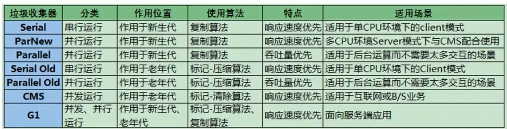

# JVM

# 内存区域

**JDK 1.7**：


**JDK 1.8**：


**线程私有的：**

- 程序计数器
- 虚拟机栈
- 本地方法栈

**线程共享的：**

- 堆
- 方法区
- 直接内存 (非运行时数据区的一部分)

# 内存分配与回收

## 内存分配

### **对象优先在 Eden 区分配**

大多数情况下，对象在新生代中 Eden 区分配。当 Eden 区没有足够空间进行分配时，虚拟机将发起一次 Minor GC。下面我们来进行实际测试一下。

### 什么时候进入老年代

- **‌年龄达到阈值‌：**默认情况下，对象在新生代经历了15次GC后，便会达到进入老年代的条件。这个阈值可以通过JVM参数进行调整，例如：-XX:MaxTenuringThreshold=10可以设置阈值为10‌。
- ‌**大对象直接进入‌：**如果创建的对象大小超过某个阈值（默认是1MB），该对象将直接进入老年代。*可以通过设置JVM参数-XX:PretenureSizeThreshold来调整这个阈值‌。*
- **‌动态年龄判断‌：**如果在Minor GC后，Survivor区域中相同年龄的所有对象大小总和超过Survivor空间的一半，年龄大于或等于该年龄的对象可以直接进入老年代‌。
- ‌**Eden区对象过多‌：**如果Eden区进行Minor GC后，存活的对象总量超过Survivor区的大小，这些对象会直接转移到老年代‌。

## 死亡对象判断

### 引用计数法

无法解决循环饮用，当除了对象 `objA` 和 `objB` 相互引用着对方之外，这两个对象之间再无任何引用时，他们的引用计数不会变成0。

### 可达性分析

这个算法的基本思想就是通过一系列的称为**“GC Roots”**的对象作为起点，从这些节点开始向下搜索，节点所走过的路径称为引用链，当一个对象到 GC Roots 没有任何引用链相连的话，则证明此对象是不可用的，需要被回收。

**哪些对象可以作为 GC Roots 呢？**

- 虚拟机栈(栈帧中的局部变量表)中引用的对象
- 本地方法栈(Native 方法)中引用的对象
- 方法区中类静态属性引用的对象
- 方法区中常量引用的对象
- 所有被同步锁持有的对象
- JNI（Java Native Interface）引用的对象

被判定为需要执行的对象将会被放在一个队列中进行第二次标记，除非这个对象与引用链上的任何一个对象建立关联，否则就会被真的回收。

## 垃圾回收

针对 HotSpot VM 的实现，它里面的 GC 其实准确分类只有两大种：

部分收集 (Partial GC)：

- 新生代收集（Minor GC / Young GC）：只对新生代进行垃圾收集；
- 老年代收集（Major GC / Old GC）：只对老年代进行垃圾收集。需要注意的是 Major GC 在有的语境中也用于指代整堆收集；
- 混合收集（Mixed GC）：对整个新生代和部分老年代进行垃圾收集。

整堆收集 (Full GC)：收集整个 Java 堆和方法区。

### 垃圾回收算法

标记-清除（Mark-and-Sweep）算法分为“标记（Mark）”和“清除（Sweep）”阶段：首先标记出所有不需要回收的对象，在标记完成后统一回收掉所有没有被标记的对象。

它是最基础的收集算法，后续的算法都是对其不足进行改进得到。**空间问题**：标记清除后会产生大量不连续的内存碎片。

复制算法将内存分为大小相同的两块，每次使用其中的一块。当这一块的内存使用完后，就将还存活的对象复制到另一块去，然后再把使用的空间一次清理掉。

标记-整理（Mark-and-Compact）算法是根据老年代的特点提出的一种标记算法，标记过程仍然与“标记-清除”算法一样，但后续步骤不是直接对可回收对象回收，而是让所有存活的对象向一端移动，然后直接清理掉端边界以外的内存。

### 垃圾收集器

```
young
--- Serial 垃圾收集器（单线程、复制）
*** ParNew 垃圾收集器（Serial+多线程、复制）
=== Parallel Scavenge 收集器（多线程、复制、高效）
old
--- Serial Old收集器（单线程、标记-整理 ）
*** CMS 收集器（多线程、标记-清除）
=== Parallel old(多线程、标记-整理)
混合
*** G1收集器  (复制+整理)

```



### 为什么使用G1

- 自适应回收 + 可预测停顿时间（-XX:MaxGCPauseMillis），减小每次STW时长
- 标记压缩 减少内存碎片（对比CMS是标记清除）
- 并发度更高，GC线程能和用户线程并行执行
- 混合回收策略，年轻代GC的时候，选择性对老年代一部分Region回收，避免长时间FullGC
- 更适合大规模的JAVA堆

### 垃圾回收 -对比

```
1、分代
  G1：弱化了分代，将堆分成了多个大小相同的region
  CMS：采用经典的分代模型，
2、并发特性
  G1：并发度更高，除了初始标记和最终标记阶段外，大部分工作都可以与应用程序线程并行执行。此外，G1还能够在混合GC阶段同时清理多个Region。
  CMS：虽然也能实现部分并发操作，如并发标记和清理，但在重新标记阶段仍然需要暂停所有应用线程（STW），而且一旦发生Concurrent Mode Failure，就会退化为单线程的Serial Old GC。
3、系统资源消耗
  G1：通常比CMS消耗更多的CPU和内存资源，因为它要维护额外的数据结构（例如Remembered Sets）用于跨Region引用跟踪，以及为了减少停顿而进行更多复杂的计算。
  CMS：对CPU资源敏感，特别是在并发阶段，如果CPU资源不足，则可能导致明显的性能下降。

       G1：更加稳定、可控的垃圾回收停顿时间，堆大小较大
       CMS：低延迟有较高要求，堆大小相对较小
```

## 什么时候进入老年代

- **‌年龄达到阈值‌：**默认情况下，对象在新生代经历了15次GC后，便会达到进入老年代的条件。这个阈值可以通过JVM参数进行调整，例如：-XX:MaxTenuringThreshold=10可以设置阈值为10‌12。
- ‌**大对象直接进入‌：**如果创建的对象大小超过某个阈值（默认是1MB），该对象将直接进入老年代。*可以通过设置JVM参数-XX:PretenureSizeThreshold来调整这个阈值‌12。*
- **‌动态年龄判断‌：**如果在Minor GC后，Survivor区域中相同年龄的所有对象大小总和超过Survivor空间的一半，年龄大于或等于该年龄的对象可以直接进入老年代‌12。
- ‌**Eden区对象过多‌：**如果Eden区进行Minor GC后，存活的对象总量超过Survivor区的大小，这些对象会直接转移到老年代‌12。

# JVM调优以及线上问题处理

## 参数

```
-Xmx:<最小堆内存>
-Xms:<最大堆内存>
-XX:NewSize=<新生代大小>
-XX:MaxNewSize=<新生代最大大小>
-XX:MetaspaceSize=<元空间大小>
-XX:MaxMetaspaceSize=<元空间最大大小>
-XX:+HeapDumpOnOutOfMemoryError -XX:HeapDumpPath=<OOM堆转储文件地址>
-XX:+Use???GC 使用某种GC
```

## 监控/故障处理/线上问题排查

给一个系统定位问题的时候，知识、经验是关键基础，数据是依据，工具是运用知识处理数据的手段。这里说的数据包括但不限于异常堆栈、虚拟机运行日志、垃圾收集器日志、线程快照（threaddump/javacore文件）、堆转储快照（heapdump/hprof文件）等。恰当地使用虚拟机故障处理、分析的工具可以提升我们分析数据、定位并解决问题的效率，但我们在学习工具前，也应当意识到工具永远都是知识技能的一层包装，没有什么工具是“秘密武器”，拥有了就能“包治百病”。

### 命令行工具

jps(JVM Process Status Tool)：列出正在运行的虚拟机进程，并显示虚拟机执行主类（Main Class，main()函数所在的类）名称以及这些进程的本地虚拟机唯一ID(LVMID，Local Virtual Machine Identifier)

jstat(JVM Statistics Monitoring Tool)是用于监视虚拟机各种运行状态信息的命令行工具。它可以显示本地或者远程虚拟机进程中的类加载、内存、垃圾收集、即时编译等运行时数据。

jinfo(Configuration Info for Java)的作用是实时查看和调整虚拟机各项参数。使用jps命令的-v参数可以查看虚拟机启动时显式指定的参数列表，但如果想知道未被显式指定的参数的系统默认值，除了去找资料外，就只能使用jinfo的-flag选项进行查询了

jmap(Memory Map for Java)命令用于生成堆转储快照（一般称为heapdump或dump文件）。

~~jhat(JVM Heap Analysis Tool)命令与jmap搭配使用，来分析jmap生成的堆转储快照。不要在生产环境使用并且很简陋，推荐其他工具。~~

jstack(Stack Trace for Java)命令用于生成虚拟机当前时刻的线程快照（一般称为threaddump或者javacore文件）。线程快照就是当前虚拟机内每一条线程正在执行的方法堆栈的集合，生成线程快照的目的通常是定位线程出现长时间停顿的原因，如线程间死锁、死循环、请求外部资源导致的长时间挂起等，都是导致线程长时间停顿的常见原因。线程出现停顿时通过jstack来查看各个线程的调用堆栈，就可以获知没有响应的线程到底在后台做些什么事情，或者等待着什么资源。`jstack [ option ] vmid`

从JDK 5起，java.lang.Thread类新增了一个getAllStackTraces()方法用于获取虚拟机中所有线程的StackTraceElement对象。使用这个方法可以通过简单的几行代码完成jstack的大部分功能，在实际项目中不妨调用这个方法做个管理员页面，可以随时使用浏览器来查看线程堆栈，

### 可视化工具

JHSDB<JConsole<VisualVM<JMC(Java Mission Control)

### 线上问题

1. StackOverflowError-无限递归
2. 死锁
3. `java.lang.OutOfMemoryError: Java heap space`
4. 堆外内存

`java.lang.OutOfMemoryError:`

`Metaspace`
`Direct buffer memory`
`GC overhead limit exceeded`
`unable to create new native thread`

1. CPU飙高-火焰图

1. 上游bug导致传入全部大量Id，导致几乎全表查询。叠加多次调用。
2. 自己写的bug全表查询了，或者逻辑问题造出了一个特别大的HashMap。
3. 不小心设置 xmn等于xmx了。

[https://javaguide.cn/java/jvm/jvm-in-action.html](https://javaguide.cn/java/jvm/jvm-in-action.html)

1. 监控堆内存60%报警，80%摘流/重启。
2. 重启或者异常时jmap dump或者用JVM参数，有时jvm dump不好获取可以考虑获取core dump后面再转换
3. 可视化工具查看支配树/直方图找到大对象

# 类加载机制